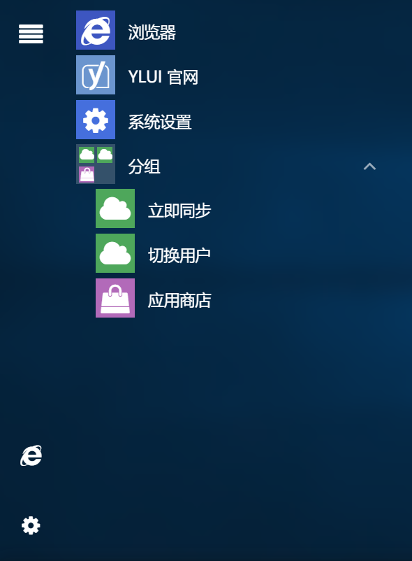

## 开始菜单



开始菜单包括左部侧边栏和菜单列表两部分，其数据结构示例如下。

```javascript
"startMenu": {
        "sidebar": [
            {
                "app": "yl-browser",
                "title": "浏览器",
                "params": {},
                "hash": ""
            },
            {
                "app": "yl-system",
                "title": "系统设置",
                "params": {},
                "hash": ""
            }
        ],
        "menu": {
            "itemPushed-85": {
                "app": "yl-browser",
                "title": "浏览器",
                "params": {},
                "hash": ""
            },
            "itemPushed-89": {
                "app": "yl-app-home",
                "title": "Mofeiの博客",
                "params": {},
                "hash": ""
            },
            "itemPushed-96": {
                "app": "yl-system",
                "title": "系统设置",
                "params": {},
                "hash": ""
            },
            "itemPushed-111": {
                "title": "分组",
                "children": {
                    "itemPushed-87": {
                        "app": "yl-server-import",
                        "title": "立即同步",
                        "params": {},
                        "hash": ""
                    },
                    "itemPushed-86": {
                        "app": "yl-server-login",
                        "title": "切换用户",
                        "params": {},
                        "hash": ""
                    },
                    "itemPushed-88": {
                        "app": "yl-app-store",
                        "title": "应用商店",
                        "params": {},
                        "hash": ""
                    }
                }
            }
        }
    }
```

`app,title,params,hash` 属性想必不用多说。

其中，对于每个菜单项，都有唯一的id标识，如`"itemPushed-85"`,`"itemPushed-86"`。菜单项可以用`children`字段表示子菜单，支持无限极分层菜单。
